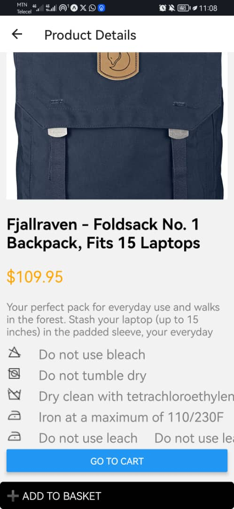
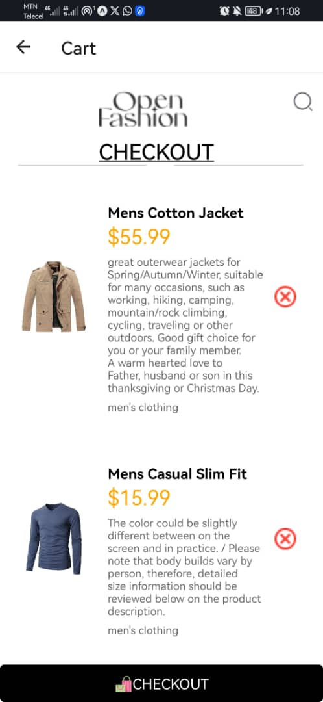

Here's a concise README file for your project:

---

# rn-assignment7-11079266

## Overview
This project is a React Native application for an online store. It features a product listing, product detail view, cart management, and a sidebar navigation menu. Users can browse products, view detailed information, add items to their cart, and view or remove items from the cart.

## Features
- **HomeScreen**: Displays a list of available products fetch from external API.
- **ProductDetailScreen**: Shows detailed information about a selected product with some precautions.
- **CartScreen**: Displays items added to the cart from both the HomeScrren and ProductdetailScreen.
- **Sidebar**: Provides shows options through a drawer component accessible via a swipe gesture or button.
- **Add to Cart/Remove from Cart**: Allows users to add products to their cart or remove them.

## Design Choices
- **HomeScreen**: Uses `FlatList` for efficient product listing, `TouchableOpacity` for interactive elements, and `AsyncStorage` for local data storage.
- **ProductDetailScreen**: Utilizes `useEffect` to fetch product details based on the selected product ID.
- **CartScreen**: Uses `FlatList` to display cart items, allowing users to remove items.
- **Sidebar**: Implemented with `Animated.View` for smooth transitions.
- **Local Storage**: Managed with `AsyncStorage` to persist cart items locally.

## Data Fetching
Data is fetched from an external API (`https://fakestoreapi.com/products`) using `fetch` within `async` functions to handle asynchronous operations. This ensures smooth data retrieval and rendering.

## Local Storage
`AsyncStorage` is used to store cart items locally on the device. This enables the app to remember the user's cart items even after closing and reopening the app.

## Screenshots

. # screenshot

