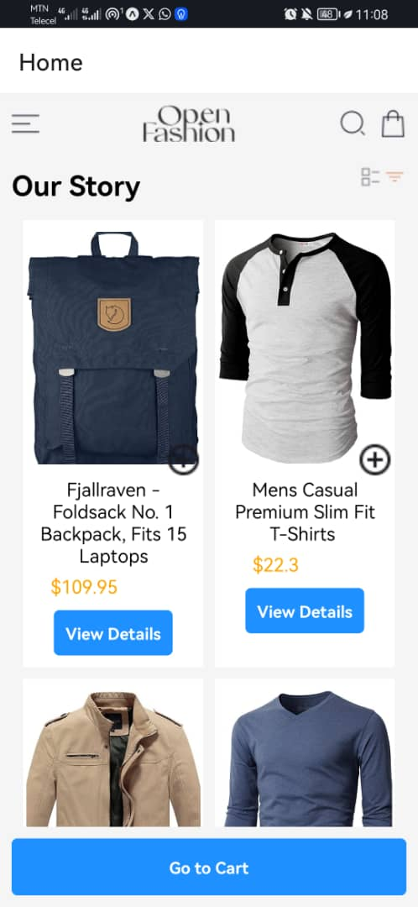

# -rn-assignment7-11079266

## Design Choices

- Used React Navigation for navigation.
- Used fetch with async/await for API requests.
- Used AsyncStorage for local storage.

## Implementation Details

- **HomeScreen**: Displays a list of products fetched from an external API.
- **ProductDetailScreen**: Displays detailed information about a product.
- **CartScreen**: Displays items added to the cart, stored in AsyncStorage.
- **Navigation**: Implemented using Drawer Navigator.

## Screenshots

. # screenshot

